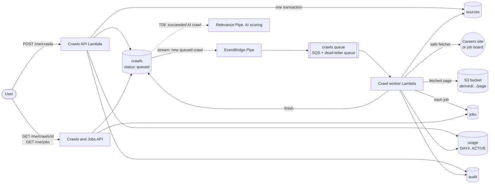
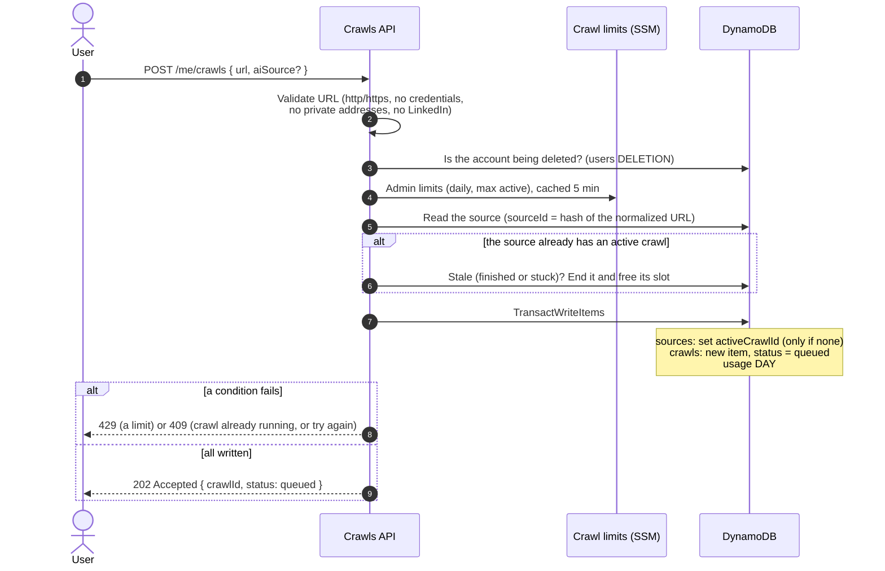
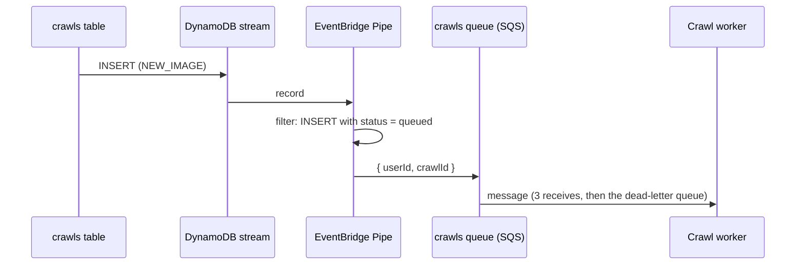
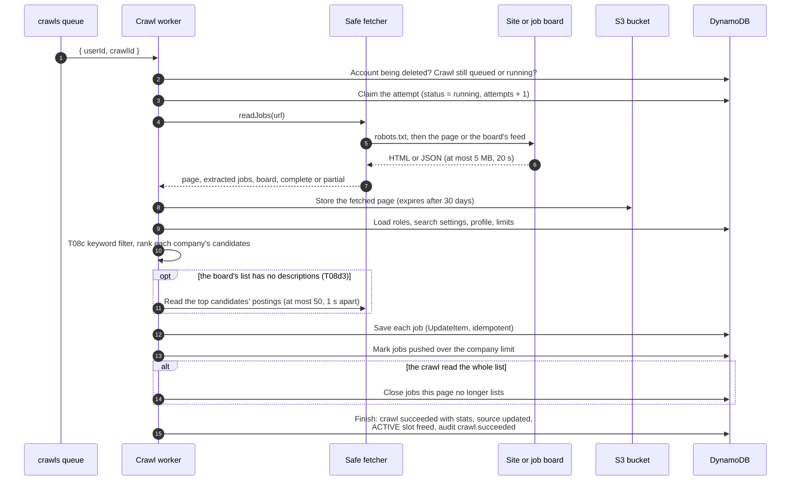
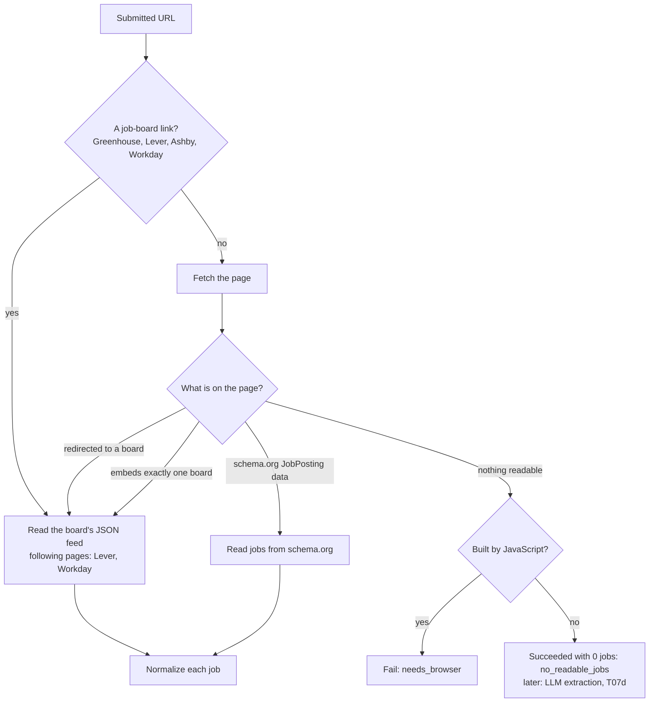
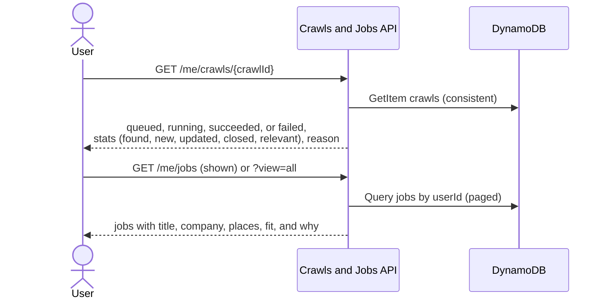

# Flow: from a submitted link to stored jobs (T06, T07)

What happens when a user submits a careers-page URL: which part runs, where each piece of information is stored, and how the parts connect. Everything runs inside one Region's cell ([0004](../decisions/0004-regional-cells-and-data-residency.md)).

- **Tasks:** [T06](../tasks/t06-async-crawl-pipeline.md) (crawl pipeline: [T06a](../tasks/t06a-safe-fetcher.md) fetcher, [T06b](../tasks/t06b-crawl-pipeline.md) pipeline, [T06c](../tasks/t06c-crawl-limits.md) limits), [T07](../tasks/t07-job-extraction-storage.md) (extraction: [T07a](../tasks/t07a-job-readers.md) readers, [T07b](../tasks/t07b-jobs-storage.md) storage, [T07c](../tasks/t07c-paging-and-closed-jobs.md) paging and closed jobs). What happens next: [relevance flow](relevance.md).
- **Visual version** (maintainer only, private link): <https://claude.ai/artifact/M8sKArJVsE8GBSZVbS6b5s>
- **Keep it true:** a PR that changes this flow updates this file, like [data-model.md](../data-model.md).

## The big picture

The API never does the slow work. It records the request and answers at once. The `crawls` table's stream, an EventBridge Pipe, and an SQS queue hand the crawl to the crawl worker. The user polls the API for the result.

## 1. The user submits a link

`POST /me/crawls` (`apps/api/src/crawls.ts`) checks everything it can without touching the web, then writes everything in one DynamoDB transaction: all of it is saved, or none.

The source's ID is a hash of the normalized URL, so one user cannot save the same page twice; the `activeCrawlId` condition stops two crawls of one page at once, even when two requests arrive together.

## 2. From the table to the worker

Nothing calls the worker directly. If the API failed right after its write, the crawl still runs: the record is in the table.

## 3. The crawl worker

`apps/worker/src/crawl-worker.ts`. One message is one crawl; every stage has a deadline inside the Lambda's time limit.

### How a link is read (T07a)

`readJobs` (`apps/worker/src/jobs/crawl-jobs.ts`) tries the cheapest, most reliable source first ([0008](../decisions/0008-job-extraction.md)).

### The safe fetcher (T06a)

- **Public addresses only:** checked when the connection opens, after DNS, so a hostname cannot point the crawler at internal addresses (SSRF).
- **Polite:** obeys robots.txt, waits 1 s between requests to one host, identifies itself as `JobDeputyBot`.
- **Bounded:** 5 s to connect, 20 s and 5 MB per page, 5 redirects, at most 10 extra requests within 150 s.
- **Clear failures:** login pages, JavaScript-only pages, 403 or 429 (blocked), and 404 or 410 (gone) each become a reason on the crawl.

### How a job is stored (T07b)

Every job becomes the same shape in `jobs`. Its `jobId` is a hash of the best posting key available, so a job is stored once per user and a re-crawl updates it:

1. `ats:<companyKey>:<externalId>`: the board's own posting ID (survives title or link changes);
2. otherwise `url:<jobUrl>`, the normalized link;
3. otherwise `text:<companyKey>|<title>|<first place>`, when one link lists several jobs.

A re-crawl sets what it read and never removes a field it did not read: a board's list often carries less than the posting itself.

### When jobs close (T07c)

The source remembers which jobs it listed (`listedJobIds`). After a **complete** crawl, a job the page no longer lists loses that source; with no source left it gets `closedAt`. A **partial** crawl (limits, or a later page that failed) never closes anything. A job listed again is reopened.

## 4. The user sees the result

## When things go wrong

| What happened | What the worker does | The crawl ends as |
|---|---|---|
| Blocked, page gone, login wall, robots.txt says no | No retry: these are answers from the web | `failed` with that reason |
| Site unreachable or 5xx | Retries after 30 s, then 120 s (or the site's Retry-After, at most 120 s) | `succeeded`, or `failed` after 3 attempts |
| Our own error (a bug, an AWS outage, the time limit) | Retries; the 3rd attempt ends the crawl, then dead-letters the message | `failed` (`internal`); the queue health check emails |
| A board's feed changed format | Logged as an error; no retry | `failed` |
| A crawl limit (500 jobs, 10 extra requests, 150 s) | Saves what it read; closes nothing | `succeeded`, partial |
| The same message delivered twice | The claim checks the status; saving a job is idempotent | unchanged |

## Where everything is stored

Every table is keyed by `userId` first. Details: [data-model.md](../data-model.md).

| Store | Key | What it holds | Written by |
|---|---|---|---|
| `sources` | `userId`, `sourceId` | Each saved page: URL, normalized URL, kind, board, `activeCrawlId`, jobs it listed last time | API (submit), worker (finish) |
| `crawls` | `userId`, `crawlId` | Each run: status, attempts, AI source, result, stats, reason, candidates for AI. Kept 180 days. | API (`queued`), worker |
| `jobs` | `userId`, `jobId` | The posting, where and when it was found, `closedAt`, the filter verdict and score, the user's own fields | Crawl worker; relevance worker (T08) |
| `usage` | `userId`, `sk` | `DAY#` crawls today, `ACTIVE` running crawls, `MONTH#` totals, `COMPANY#` shown jobs per company | API (counts), worker (frees the slot) |
| `audit` | `userId`, `auditId` | `crawl.requested`, `crawl.succeeded`, `crawl.failed`. Kept 1 year. | API and worker, in the same transaction as the change |
| S3 | `derived/users/<userId>/crawls/<crawlId>/page` | The fetched page. Deleted after 30 days. | Crawl worker |
| SSM | `/jobdeputy/<stack>/crawl-limits` | Admin limits: crawls per day, active crawls, jobs per company, expiry | Admin; read by API and worker |

## Limits

| Scope | Limit |
|---|---|
| Per user (T06c) | 20 crawls a day by default (admin max 50); 1 crawl at a time; 1 crawl per page at a time |
| Per crawl (T07c) | 500 jobs saved; 10 extra requests; 150 s budget; 1 s gap per host |
| Per request (T06a) | 5 s to connect; 20 s and 5 MB per page; 5 redirects |
| Retries | 3 attempts; waits of 30 s and 120 s; then the dead-letter queue |
