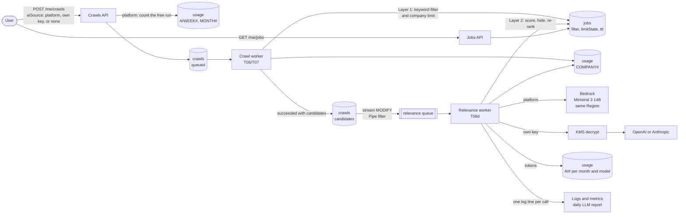
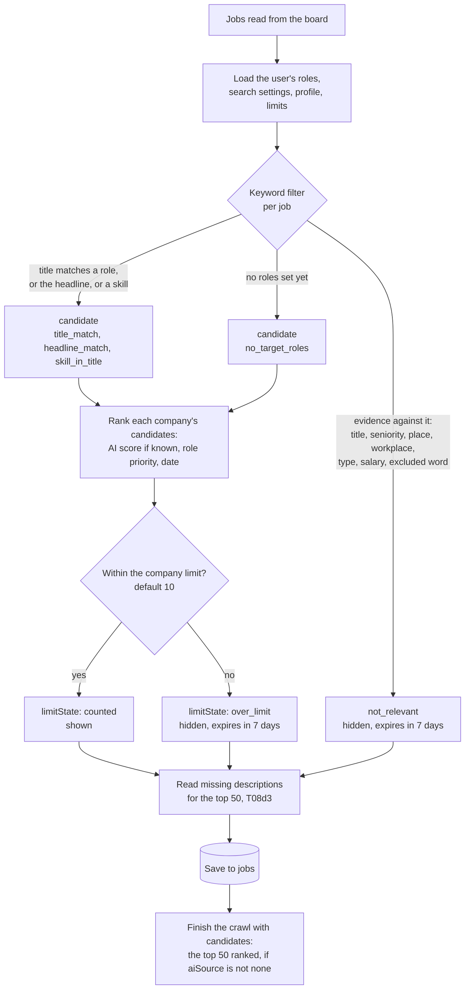
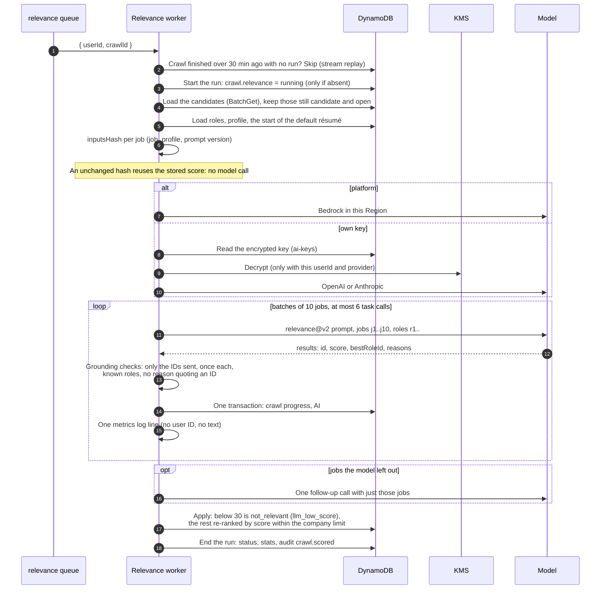
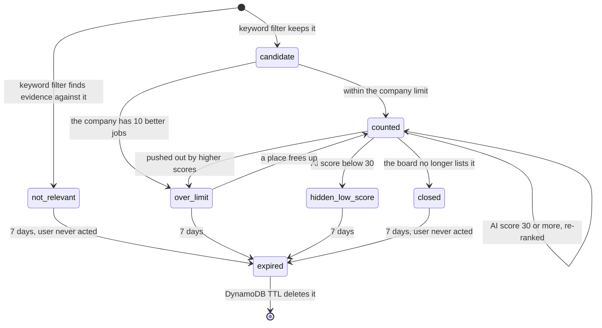

# Flow: which jobs the user sees, and why (T08)

A crawl can find hundreds of jobs. T08 decides which few a person sees, each with a score and short reasons, in two layers: a free keyword filter on every job, then an AI model that scores the best candidates.

- **Tasks:** [T08](../tasks/t08-relevance-filter.md): [T08a](../tasks/t08a-ai-model.md) model, [T08b](../tasks/t08b-llm-foundation.md) LLM foundation, own keys, usage, [T08c](../tasks/t08c-code-filter.md) keyword filter, company limit, expiry, [T08d](../tasks/t08d-llm-relevance.md) AI scoring, [T08e](../tasks/t08e-live-effectiveness.md) live quality. What comes before: [crawl flow](crawl.md).
- **Visual version** (maintainer only, private link): <https://claude.ai/artifact/VYgD3aAFUeBMutL9gKkujZ>
- **Keep it true:** a PR that changes this flow updates this file, like [data-model.md](../data-model.md).

## The two layers

| | Layer 1: keyword filter | Layer 2: AI score |
|---|---|---|
| Runs in | the crawl worker, on every crawl (T08c) | the relevance worker, after AI crawls only (T08d) |
| Costs | nothing | model tokens (platform allowance or the user's key) |
| Looks at | title, place, workplace, type, salary against the target roles and search settings | the profile and résumé excerpt next to up to 50 candidates |
| Gives | `candidate` or `not_relevant`, with reasons | a score 0–100, the best role, up to 3 reasons |
| Hides | only on evidence (lenient: what a list does not say never counts against a job) | a score below 30 |

On top of both, each company shows at most **10 jobs** (the user can change it), and hidden jobs expire after **7 days**.

## The big picture

## Before the crawl: choosing the AI

Every crawl carries an `aiSource`: the user's choice for that crawl, or their default (`/me/ai-settings`).

| `aiSource` | Meaning | Checked at submit |
|---|---|---|
| `platform` | Our model: Ministral 3 14B on Amazon Bedrock, in the user's Region ([0010](../decisions/0010-platform-ai-model.md)). Free within an allowance. | 1 run a week, 4 a month, counted in the crawl's transaction (`usage` `AIWEEK#`, `MONTH#`); `429` when used up. |
| `openai`, `anthropic` | The user's own key (T08b2, [0009](../decisions/0009-llm-architecture-and-own-keys.md)), encrypted with the cell's KMS key and bound to that user and provider. The profile and résumé text go to that provider; the consent text says so. | The key exists and is not marked invalid (keys are checked in the background when saved; at most 5 checks a day). |
| `none` | Keyword filter only; no model call. | Nothing. |

## Layer 1, inside the crawl worker (T08c)

Runs between reading the jobs and saving them (`apps/worker/src/relevance/`).

The company limit is a snapshot in `usage` `COMPANY#<companyKey>`: the jobs shown for that company and their rank. A crawl replaces it only if nobody changed it since it was read (a version check), so two crawls cannot both take the same places. A job that closes frees its place.

## Layer 2, the AI scoring run (T08d)

### How the run starts

When the crawl worker marks a crawl `succeeded`, the crawls stream emits a `MODIFY`. A second EventBridge Pipe passes it to the relevance queue only when:

- the status is `succeeded`;
- `aiSource` is not `none`;
- the crawl found at least one relevant job (`jobsRelevant` > 0);
- the crawl has no `relevance` run yet. The worker's first write adds one, so its own writes never start another run.

### What the worker does

Each task call is its own transaction: the crawl stores `relevance.calls` and `relevance.sent` with the scores and the tokens, so a retried message never sends a job twice, never counts tokens twice, and never goes past 6 task calls.

## What a job's state can be

`GET /me/jobs` shows **counted** jobs by default; `?view=all` shows everything. A job the user acted on never expires.

## Safety rules around the model

| Rule | How it is enforced |
|---|---|
| Bounded cost | At most 50 jobs, 6 task calls, and 18 model calls per crawl, across retries. Each call has an output token cap and a 60 s timeout. A job sends its first 1,500 description characters; the résumé its first ~6,000 ([0002](../decisions/0002-llm-loop-and-token-budget.md)). |
| Prompt injection | Job text is untrusted. Code accepts only the job IDs sent, once each, and only the user's real roles. Injection cases are in the eval ([0010](../decisions/0010-platform-ai-model.md)). |
| No silent fallback | A missing or invalid own key ends the run (`key_missing`, `key_invalid`); a key the provider rejects ends it at once (`key_rejected`). It never switches to the platform model. |
| Provider outage | The queue retries; the last attempt ends the run (`model_unavailable`). Unscored jobs keep their keyword verdict. |
| Data residency | The platform model runs in the user's Region. Own keys send data to that provider, with consent. |
| Readable reasons (#62) | Reasons name roles by title; a reason quoting an internal ID such as `r1` is dropped and counted. |
| Quality gate | Every prompt, schema, or model change runs the eval against a saved baseline; a regression fails the PR. |

## Where everything is stored

Details: [data-model.md](../data-model.md).

| Store | Item or field | What it holds |
|---|---|---|
| `jobs` | `filter` | Keyword verdict, matched roles, reasons, role priority |
| `jobs` | `relevance` | AI score, best role, reasons, model, prompt version, inputs hash, when |
| `jobs` | `limitState`, `ttl` | `counted` or `over_limit`; when a hidden job expires |
| `crawls` | `candidates`, `relevance`, `llm` | The top 50 to score; the run's status, calls, jobs sent, stats; tokens used |
| `usage` | `COMPANY#<company>` | Each company's shown jobs and rank (versioned) |
| `usage` | `AIWEEK#`, `MONTH#` | Crawls that used a free platform run |
| `usage` | `AI#<month>#<source>#<provider>#<model>` | Calls and tokens per month and model (`GET /me/ai-usage`) |
| `ai-keys` | `userId`, `provider` | The encrypted own key and its check status |
| `preferences` | `ROLE#`, `SEARCH`, `AI_SETTINGS` | Target roles, search settings, default AI source |
| SSM | `crawl-limits` | Admin settings: company limit, expiry days, free runs, jobs to score, low-score cut-off |

## How we know it keeps working

- **Every task call** writes one log line: calls, tokens, latency, rejected outputs, grounding rejections, score spread, jobs sent, low scores. Never a user ID or text.
- **Metrics and alarms** (T08b3): totals and per task; alarms on 10 or more rejected outputs, or 5 or more timeouts, in an hour.
- **Queue health check** (T08d1): every 5 minutes; emails when the relevance queue backs up or has dead letters.
- **Daily LLM report** (T08e1, [#65](https://github.com/jobdeputy/jobdeputy/issues/65)): per prompt version and model against limits; emails only when one is crossed.
- **Next** (T08e2, [#66](https://github.com/jobdeputy/jobdeputy/issues/66)): a sample rescored by a second model, a shadow prompt, and gradual rollout of prompt or model changes.

## Numbers

| What | Value |
|---|---|
| Jobs shown per company | 10 (admin and user settings) |
| Hidden below score | 30 |
| Hidden jobs expire after | 7 days |
| Jobs scored per crawl | at most 50, 10 per call |
| Calls per crawl | at most 6 task calls, 18 model calls |
| Free platform runs | 1 a week, 4 a month |
